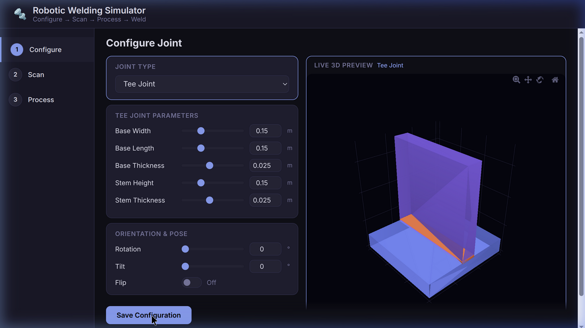
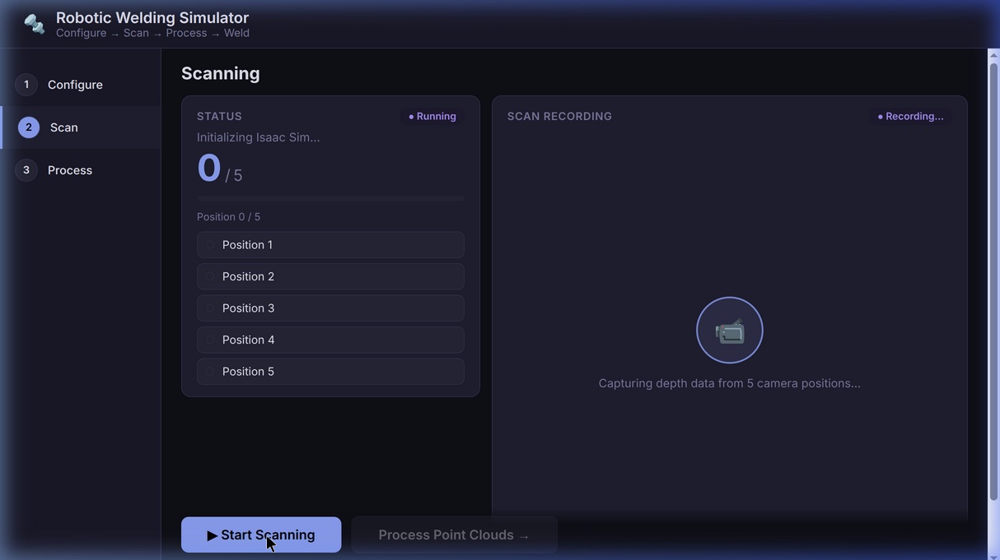
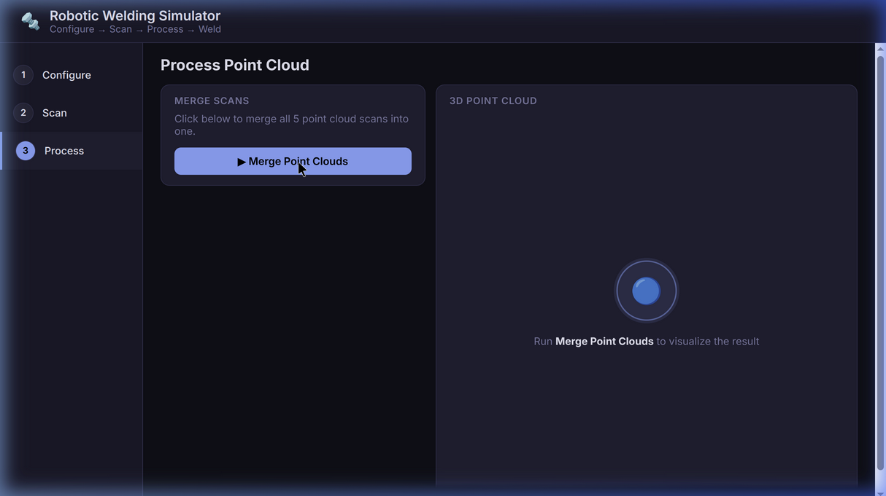

# Synarcs Welding Simulator

**[Synarcs](https://synarcs.com/)** bridges the virtual and real worlds with hybrid simulation environments to accelerate industrial robot deployment, training, and optimization.

This repository contains the **Synarcs Welding Simulator**, a browser-based visualization and testing workspace integrating interactive UI configurations with **NVIDIA Isaac Sim** point cloud generation and processing. It serves as a foundational tool for developing and validating robotic welding autonomy before physical deployment.

## Features

- **Dynamic Joint Configuration**: Live 3D parameterization of 5 standard AWS welding joints (Tee, Butt, Lap, Corner, Edge).
- **Automated Scanning**: Headless orchestration of NVIDIA Isaac Sim using Universal Robots UR10 to navigate and capture multi-angle depth point clouds of the joint.
- **Point Cloud Processing**: Automatic merging and visualization of the scanned point cloud data natively in your browser.
- **Modular Pipeline**: Built using a modern Python package structure (`src/welding_simulator`) designed to support pluggable simulation engines and computer vision seam detection algorithms.

## System Requirements

- Ubuntu 22.04 or 24.04
- Python 3.11
- NVIDIA GPU (RTX series recommended for Isaac Sim) with latest drivers (Vulkan API support)
- NVIDIA Isaac Sim (v4+ or equivalent `isaacsim` pip package)

## Installation

1. **Clone the repository**:
   ```bash
   git clone <repository_url>
   cd simulator
   ```

2. **Create and Activate a Virtual Environment** (requires Python 3.11 for Isaac Sim compatibility):
   ```bash
   python3.11 -m venv .venv
   source .venv/bin/activate
   ```

3. **Install Dependencies**:
   ```bash
   pip install --upgrade pip
   pip install fastapi uvicorn websockets open3d numpy pillow opencv-python "pydantic>=2.9.2"
   ```

4. **Install NVIDIA Isaac Sim**:
   *Note: This package requires access to the NVIDIA package index.*
   ```bash
   pip install isaacsim --extra-index-url https://pypi.nvidia.com
   ```

## Usage

Start the simulator web interface by running the launcher script:

```bash
bash scripts/run_webapp.sh
```

Navigate to `http://localhost:8000` in your web browser.

### The Simulation Pipeline

The interface guides you through three distinct simulation stages:

#### 1. Configure
Select your joint type and use the parametric sliders to adjust dimensions interactively. View the live 3D preview and click **Save Configuration**.



#### 2. Scan
Click **Start Scanning**. This triggers an Isaac Sim headless instance in the background. The UR10 robotic arm is spawned, the custom joint geometry is dynamically mapped, and the arm uses path-planning to navigate to 5 optimal camera viewpoints. Wait for the live progress bar to reach 100%.



#### 3. Process
Click **Merge Point Clouds**. The backend will process the 5 distinct captures (depth and color) output by the previous step and merge them into a solitary 3D reconstruction. You can inspect the fully merged point cloud directly in the browser viewport.



## Developer Documentation & Architecture

The codebase has been refactored from standalone shell scripts into a modular, production-ready Python package hosted in `src/welding_simulator/`.

### Directory Structure

```text
simulator/
├── config/                  # Joint and algorithm configurations
├── data/latest/             # Automatically generated simulation outputs
├── scripts/                 # Entrypoint bash scripts
├── src/
│   └── welding_simulator/   # Main Python package
│       ├── api/             # FastAPI backend implementation
│       ├── core/            # Business logic and geometry generation (joint_factory.py)
│       ├── perception/      # Standalone Computer Vision processing and seam algorithms
│       └── sim/             # Abstact simulation logic and engines (Isaac Sim implementation)
└── docs/                    # Static assets used in documentation
```

### Extending the Simulator

- **Simulation Engines**: The codebase abstracts simulation commands under `src/welding_simulator/sim/base.py`. Developers can inherit this base class to create wrappers for new engines (e.g., Gazebo or PyBullet) alongside the existing `isaac_sim` implementation.
- **Seam Finding Algorithms**: Base algorithm pipelines live in `src/welding_simulator/perception/`. Custom algorithms can be plugged in to replace or supplement standard planar heuristics and point cloud analysis.
